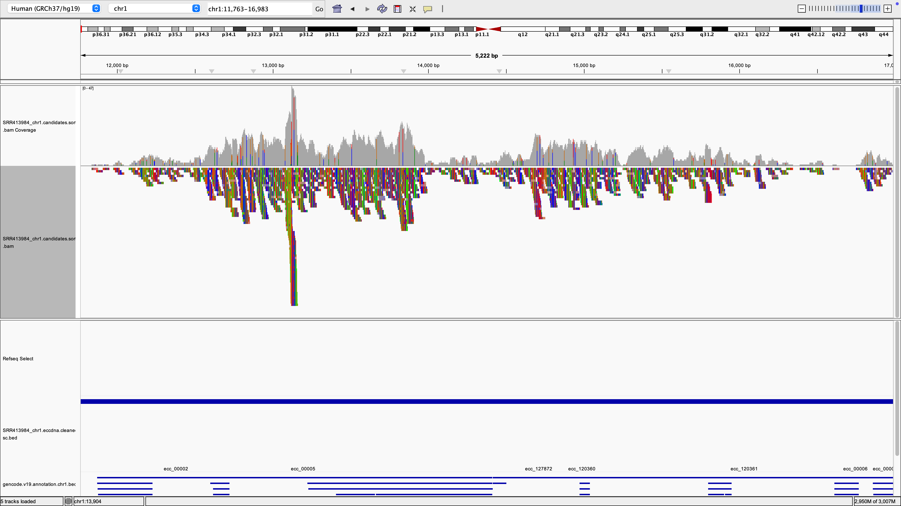
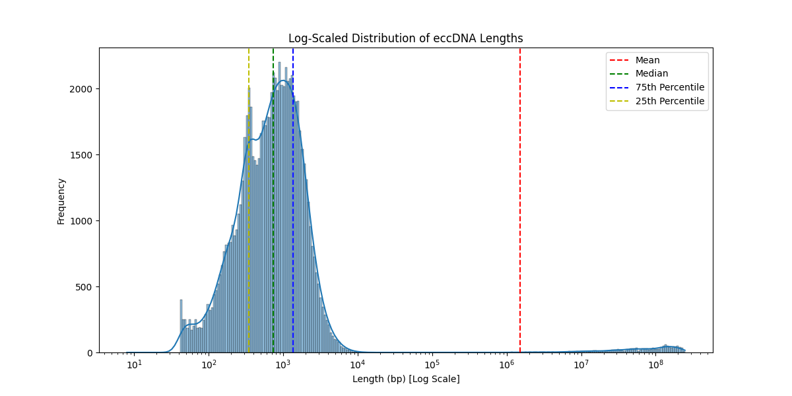
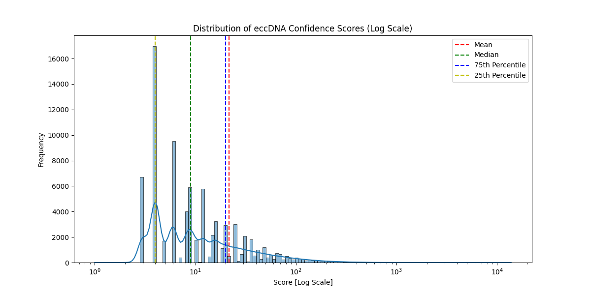

# microDNA Detection and Analysis

[](https://www.python.org/downloads/)
[]()

A reproducible bioinformatics pipeline for detecting, extracting, and annotating **microDNA** (small extrachromosomal circular DNA, 100–400 bp) from high-throughput sequencing data.

---

## Overview

Extrachromosomal circular DNA (eccDNA) are DNA molecules found outside of chromosomes that have been implicated in gene amplification, aging, and cancer. This pipeline leverages [Circle-Map](https://github.com/iprada/Circle-Map) to identify eccDNA candidates from paired-end sequencing reads, then cleans, filters, and annotates them with genomic features from GENCODE.

### Key Features

- **Automated Detection**: Uses Circle-Map's statistical approach to identify circular DNA candidates.
- **Size Filtering**: Filters candidates to the microDNA size range (100–400 bp).
- **Gene Annotation**: Annotates eccDNA with nearest genes using GENCODE.
- **Reproducible**: Docker-based workflow ensures consistent results across platforms.
- **Modular CLI Scripts**: Each pipeline step is a separate, reusable command-line tool.

---

## Project Structure

```
microDNA-Detection-and-Analysis/
├── data/
│   ├── inputs/
│   │   ├── fastq/              # Raw FASTQ reads
│   │   └── references/
│   │       ├── genome/         # Reference genome (GRCh37)
│   │       └── annotations/    # GENCODE GTF/BED files
│   ├── intermediate/           # Alignment and candidate BAMs (generated)
│   ├── outputs/                # Final annotated results
│   └── toy_data/               # Sample data for testing
├── docker/                     # Docker configuration
│   ├── Dockerfile.circlemap    # Circle-Map Docker image
│   └── run_upstream_pipeline.sh # Upstream pipeline script
├── src/microdna/               # Python CLI scripts
├── src/utils/shell_scripts/    # Shell utility scripts
├── tests/                      # Unit tests (41 tests)
├── environment.yml             # Conda environment
├── pyproject.toml              # Package configuration
├── requirements.txt            # Python dependencies
└── README.md
```

---

## Quick Start

### Prerequisites

- [Docker](https://docs.docker.com/get-docker/) (required for full pipeline)
- [Conda](https://docs.conda.io/en/latest/miniconda.html) (optional, for local development only)
- ~50 GB disk space (for reference genome and example data)

### Installation

```bash
# Clone the repository
git clone https://github.com/JasonHunter95/microDNA-Detection-and-Analysis.git
cd microDNA-Detection-and-Analysis

# Docker images are built automatically on first run
# No additional setup required!
```

<details>
<summary>Optional: Local Development Setup</summary>

```bash
# Create and activate the conda environment
conda env create -f environment.yml
conda activate circlemap-env

# Install Python dependencies and the package in editable mode
pip install -e .
```
</details>

### Data Setup

All data acquisition runs in Docker for reproducibility.

```bash
# Download reference genome, annotations, and sample data (~15GB total)
./docker/setup_data.sh --sample SRR413984

# Align reads to reference (~2-4 hours for full sample)
./docker/run_alignment.sh SRR413984 8

# Run the complete analysis pipeline
./docker/run_full_pipeline.sh \
    data/intermediate/SRR413984.sorted.bam \
    data/inputs/references/genome/GCF_000001405.13_GRCh37_genomic.fna \
    data/inputs/references/annotations/gencode.v19.annotation.genes.sorted.bed \
    data/outputs/SRR413984
```

<details>
<summary>Setup script options</summary>

```bash
./docker/setup_data.sh --help
./docker/setup_data.sh --skip-reference    # Skip reference genome
./docker/setup_data.sh --skip-annotation   # Skip annotations
./docker/setup_data.sh --skip-index        # Skip BWA indexing
```
</details>

---

## Pipeline Workflow

```mermaid
flowchart LR
    A[FASTQ Reads] --> B[BWA-MEM2 Alignment]
    B --> C[Sorted BAM]
    C --> D[Query-sorted BAM]
    D --> E[Circle-Map ReadExtractor]
    E --> F[Candidate BAM]
    F --> G[Circle-Map Realign]
    G --> H[Raw eccDNA BED]
    H --> I[microdna.clean_bed]
    I --> J[bedtools closest]
    J --> K[microdna.annotate_eccdna_closest]
    K --> L[Annotated TSV]
```



---

## CLI Scripts Reference

All scripts are available as `microdna` modules.

| Script | Purpose |
|--------|---------|
| `clean_bed` | Format BED files to BED6 with unique eccDNA IDs |
| `annotate_eccdna_closest` | Annotate eccDNA with closest genes |
| `annotate_eccdna_intersected` | Annotate eccDNA with overlapping genes |
| `parse_intersected` | Parse bedtools intersect output |
| `unique_eccdna_table` | Aggregate eccDNA by unique ID |
| `cleaner_tsv` | Filter and validate eccDNA annotations |
| `eccdna_length_distribution` | Plot eccDNA length distribution |
| `eccdna_score_distribution` | Plot eccDNA score distribution |
| `get_soft_clips` | Count soft-clipped reads in BAM |
| `print_soft_clipped_reads` | Display soft-clipped read details |
| `sw` | Smith-Waterman local alignment |
| `get_seq` | Analyze eccDNA junction sequences |

---

## Detailed Usage

### 1. Data Acquisition

```bash
# Download sequencing reads
fasterq-dump SRR413984 --split-files -O data/inputs/fastq/

# Download reference genome
bash src/utils/shell_scripts/get_ref_genome.sh

# Prepare GENCODE annotations
bash src/utils/shell_scripts/prepare_gencode_v19_annotation.sh
```

### 2. Alignment

```bash
# Index reference
bwa-mem2 index data/inputs/references/genome/GCF_000001405.13_GRCh37_genomic.fna
samtools faidx data/inputs/references/genome/GCF_000001405.13_GRCh37_genomic.fna

# Align and sort
bwa-mem2 mem -t 8 data/inputs/references/genome/GCF_000001405.13_GRCh37_genomic.fna \
    data/inputs/fastq/SRR413984_1.fastq data/inputs/fastq/SRR413984_2.fastq | \
    samtools sort -@ 8 -m 1G -o data/intermediate/SRR413984.sorted.bam

# Index BAM
samtools index data/intermediate/SRR413984.sorted.bam
```

### 3. Full Pipeline (Docker)

Run the complete pipeline in Docker with a single command:

```bash
./docker/run_full_pipeline.sh \
    data/intermediate/SRR413984.sorted.bam \
    data/inputs/references/genome/GCF_000001405.13_GRCh37_genomic.fna \
    data/inputs/references/annotations/gencode.v19.annotation.genes.sorted.bed \
    data/outputs/SRR413984
```

This runs both upstream and downstream in Docker:

**Upstream** (Circle-Map):
1. Query-sort BAM
2. Circle-Map ReadExtractor
3. Sort/index candidate BAM  
4. Circle-Map Realign → outputs `*.eccdna.bed`

**Downstream** (microdna):
5. Clean BED format → `*.eccdna.cleaned.bed`
6. Sort and find closest genes
7. Generate annotated output → `*.eccdna.annotated.tsv`

<details>
<summary>Run upstream/downstream separately</summary>

```bash
# Upstream only
./docker/run_upstream_pipeline.sh \
    data/intermediate/SRR413984.sorted.bam \
    data/inputs/references/genome/GCF_000001405.13_GRCh37_genomic.fna \
    data/intermediate/SRR413984

# Downstream only
./docker/run_downstream_pipeline.sh \
    data/intermediate/SRR413984.eccdna.bed \
    data/inputs/references/annotations/gencode.v19.annotation.genes.sorted.bed \
    data/outputs/SRR413984
```
</details>

---

## Output Format

The final annotated TSV contains:

| Column | Description |
|--------|-------------|
| `ecc_id` | Unique eccDNA identifier (e.g., `ecc_00001`) |
| `ecc_chrom` | Chromosome |
| `ecc_start` | Start position (0-based) |
| `ecc_end` | End position |
| `gene_id` | ENSEMBL gene ID |
| `gene_name` | Gene symbol |
| `gene_type` | Gene biotype (protein_coding, lncRNA, etc.) |
| `distance` | Distance to nearest gene (0 if overlapping) |

---

## Example Results

### eccDNA Visualization in IGV

Circular DNA candidates detected on chromosome 1, visualized in the Integrative Genomics Viewer:



### Distribution Analysis

The pipeline generates distribution plots to characterize detected eccDNA:

| Length Distribution | Score Distribution |
|:---:|:---:|
|  |  |

---

## Testing

Run the test suite:

```bash
conda activate circlemap-env
pytest tests/ -v -n auto
```

**Current status**: 41 tests passing

---

## Development

### Linting

```bash
ruff check src/
```

### Code Style

This project uses:
- **ruff** for linting
- **Type hints** for function signatures
- **Docstrings** for all public functions
- **argparse** for CLI interfaces

---

## Windows Setup (WSL)

This pipeline requires a Unix environment. On Windows, use **Windows Subsystem for Linux (WSL2)**:

1. **Install WSL2** (PowerShell as Administrator):
   ```powershell
   wsl --install
   ```

2. **After restart**, open Ubuntu and install Miniconda:
   ```bash
   wget https://repo.anaconda.com/miniconda/Miniconda3-latest-Linux-x86_64.sh -O miniconda.sh
   bash miniconda.sh
   source ~/.bashrc
   ```

3. **Clone and set up** (from WSL terminal):
   ```bash
   cd ~
   git clone https://github.com/JasonHunter95/microDNA-Detection-and-Analysis.git
   cd microDNA-Detection-and-Analysis
   conda env create -f environment.yml
   conda activate circlemap-env
   ```

> **Tip**: For better performance, work within the WSL filesystem (`~/`) rather than `/mnt/c/`.

---

## References

- **Circle-Map**: Prada-Luengo, I., Krogh, A., Maretty, L., & Regenberg, B. (2019). Sensitive detection of circular DNAs at single-nucleotide resolution using guided realignment of partially aligned reads. *BMC Bioinformatics*, 20(1), 1-9. [GitHub](https://github.com/iprada/Circle-Map)
- **GENCODE**: [gencodegenes.org](https://www.gencodegenes.org/)

---
